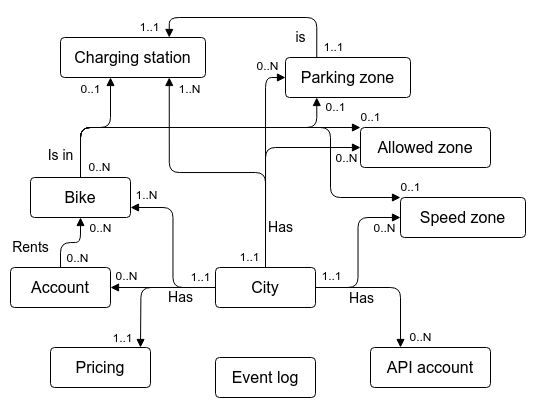

# Modellering av databas för Svenska Elsparkcyklar AB
## Konceptuell modellering
### Beskrivning av systemet i text

Företaget har behov av ett system som hanterar uthyrning av elsparkcyklar i svenska städer.

Företaget är verksamma i 3 olika städer och planerar att expandera till fler städer med stöd av ett nytt datasystem.

Datasystemet har följande delar:

#### Backend

Webbaserad lösning med koppling mot databas för att administrera cyklar, kunder, laddstationer, parkeringsplatser/zoner, utlåning/återlämning etc.

Ett REST API som tredjepartsleverantörer kan använda för att bygga extra tjänster och applikationer. REST API:et skall kunna hantera olika versioner samt autentisering.

Eventuellt ett realtidsgränssnitt med t ex websockets, för att hantera cykelns position och hastighet, och till exempel kunna begränsa hastigheten eller stoppa cykeln.

#### Administrativt webbgränssnitt (Frontend 1)

Möjlighet för anställda att se status på cyklar, stationer och kunder.

#### Kundens webbgränssnitt (Frontend 2)

Kunden kan logga in och se sitt konto, historik av utlåning och betalningar.

#### Kundens mobilapp (Frontend 3)

Kunden kan låna och lämna tillbaka cykeln samt se status på senaste resan och historik över gjorda resor.

#### Cykelns inbyggda system

Styr och övervakar cykeln (på, av, hastighet, begränsa hastighet, position, behöver service/laddning).

#### Simulering och test

Simulera hela systemets drift för att kunna testa och verifiera funktionen.

#### Vad skall systemet klara av att hantera

* Städer &ndash; välja, lägga till, ta bort 
* Cyklar &ndash; lägga till, ta bort, slå på/av, sätta i underhållsläge / laddningsläge, begränsa hastighet, boka, lämna tillbaka, se position / hastighet / laddning / servicebehov
* Laddstationer &ndash; lägga till, ta bort, position, antal platser, vilka cyklar som laddas
* Parkeringsplatser/zoner &ndash; lägga till, ta bort, position, vilka cyklar är parkerade
* Tillåtna zoner &ndash; cykeln stängs av utanför tillåten zon
* Begränsade zoner &ndash; med lägre hastighet
* Kunder/Konton &ndash; registrera konto, logga in/ut, se historik med detaljer och kostnad, fylla på konto med pengar, ange extern betalningstjänst
* Taxa/Prislista &ndash; startavgift, minutavgift, extra avgift vid "fri" parkering, lägre startavgift vid hämtning på fri parkering och lämning på anvisad parkering
* Externa appar &ndash; ansluter via REST API, registrera konto, begränsa användning
* Loggning av händelser i systemet

### Identifierade entiteter (engelska)

- City
- Bike (scooter is more correct but a longer word)
- Charging station
- Parking zone
- Allowed zone
- Speed zone
- Account
- Pricing (start fee, per minute, extra, discount)
- API account
- Event log

### Identifierade relationer (förenklat)

| Entity        | City | Bike | Charg. st. | P. zone | Account | Pricing |
| -------- | :--: | :--: | :------: | :----: | :-----: | :----: |
| **City**      |      | has  | has          | has     | has     | has     |
| **Bike**      | in   |      | in           | in      | used by |         |
| **Charg. st.**| in   | has  |              | is      |         |         |
| **P. zone**   | in   | has  | is           |         |         |         |
| **Account**   | in   | rent |              |         |         |         |
| **Pricing**   | in   |      |              |         |         |         |

### ER-diagram med kardinalitet

### Exempel på attribut

- City &ndash; `id, name`
- Bike  &ndash; `id, city_id, number, current_user (account), status (on, off, free, charging, service, ...), battery_level, speed, gps_position`
- Charging station &ndash; `id, city_id, nof_places, bikes (currently charging), gps_position`
- Parking zone &ndash; `id, city_id, is_charging_st, nof_places, bikes (currently parked), gps_position`
- Allowed zone &ndash; `id, city_id, gps_position (how to define?)`
- Speed zone &ndash; `id, speed_limit, city_id, gps_position (how to define?)`
- Account &ndash; `id, city_id, name, address, phone, balance, bank_account, history_log (of rentals)`
- Pricing &ndash; `city_id, start_fee, minute_fee, extra_fee, discount`
- API account &ndash; `id, city_id, company, address, phone, limit`
- Event log &ndash; `time_stamp, event_type, text, ...`

### Kommentarer

- Charging station kan ses som ett specialfall av en parking zone.
- Allowed zone kan ses som ett specialfall av en speed zone med `speed_limit = 0`.

